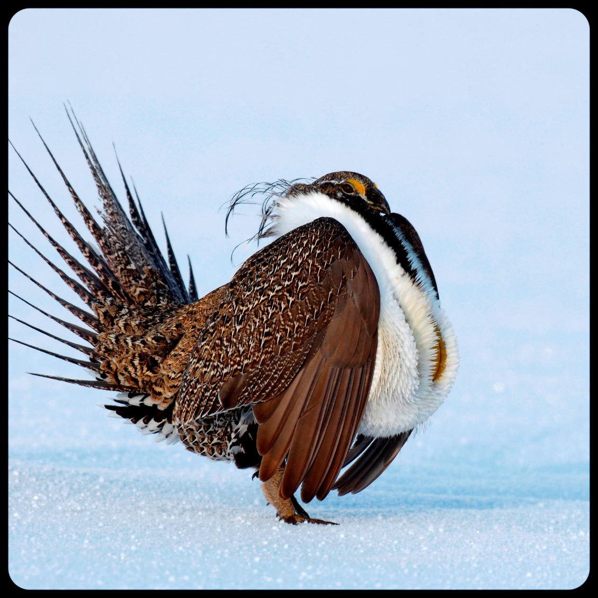

# Data  

## Writing scripts

When writing R scripts there are a couple things to keep in mind that will make your life much easier. Future you, will thank present you. Most of the time you will write your scripts in an R script file and then send your commands to the R Console from that file. Always start your code with a text header that provides information about your script file so that future you (and others) know what the script does and can reproduce your analysis. At a minimum I suggest the following: 

- Brief description of the script (i.e., a title)
- The date the script was created or last modified (there are more elegant ways to keep track of this that we will address later)
- The author of the script
- R version used when creating the script (R packages change. This is important.)

Other items that I ask everyone in my research group to include are: 

- Packages required to run the code (there are more elegant ways to keep track of this that we will also address alter)
- Data inputs and sources
- Data outputs

Here is an example of the Header text I try to include in all my scripts. Obviously, not all this information is available at the beginning of an analysis, but I encourage you to update your header as you go.

```{r eval=FALSE, echo=TRUE}
#=============================================================================#
# HEADER ---------------------------------------------------------------------
#
#  Author: Brad Fedy
#
#  R.Version(): Version 4.3.1
#
#  Project: 
#  Grassland birds habitat selection
#
#  Required libraries: 
#  Mumin, data.table
# 
#  Required input files: 
#  1. Bird location data e.g., "species.routes.SPPI.csv"
#  2. Covariate values at each scale creaeted in step _3.. Example naming:
#     "SPPI.covariates.`scale'.csv"
#
#  Steps:
#  1. PREPARE DATA FOR MODELLING
#  2. RUN UNIVARIATE MODELS
#  3. CORRELATIONS AMONG TOP COVARIATES
#  4. UNIVARIATE MODELS FOR ALL CORRELATED PAIRS
#
#  Output files: 
#  1. Table of univariate results across all scales for each variable. 
#     e.g., "SPPI.model.result.",env[[s]],".csv"
#  2.  Table of univariate results of each highly correlated pair
#     e.g., "SPPI.cor.var.models.",x,".csv" where `x' is a number 1 to n pairs
#
#  Date: 2023/05/13
#
#  NOTES: 
#=============================================================================#

rm(list=ls())
setwd("/Users/bfedy/grassland.birds/DATA/Bird.Data")
library("MuMIn")
library("data.table")
```

The formatting of your scripts can be a matter of personal preference. There are a number of style guides available. Hadley Wickham has one associated with his [Advanced R book](http://adv-r.had.co.nz/Style.html) and Google's R Style Guide can be found in multiple locations on the internet. Basically, try to make it readable, easily understood, and do not be shy with your use of `# comments` throughout. You will be grateful later. Really.... more comments are almost always better.

## Importing, viewing, and editing data

```{r Greater-sage-grouse, out.width="70%", fig.show="hold", echo=FALSE, fig.align='center'}

```

Greater Sage-Grouse (*Centrocercus urophasianus*; hearafter sage-grouse) are ground nesting bird, distributed across the intermountain west with a range that crosses 11 states and 2 Canadian provinces. They are listed under the Canadian Species At Risk Act and of conservation concern throughout their distribution in the United States. Their distribution is roughly consonant with the distribution of sagebrush (Artemisia sp.) habitat. The major negative impacts to sage-grouse are habitat loss, invasive species, and energy development across their range. Sage-grouse have a lek mating system in which males congregate at breeding sites (i.e., leks) each spring to compete for mating opportunities using  elaborate 'strutting' displays to attract females. There have been large efforts across their range to collect detailed ecological and population data - typically focused on lek sites. Approximately 35% of the remaining sage-grouse occur in Wyoming. Long term monitoring data exists for many of the active leks across Wyoming  which are visited 1-3 times per lek season by biologists who count the number of males displaying at a lek. By convention, the highest number of males recorded across all visits is used as the lek size for a given year. These counts are considered a good index of overall population size and are used to assess trends in population numbers. This ongoing effort was started in 1948 and has resulted in a large dataset with thousands of leks where males have been counted and recorded each year. We will use some of these data to demonstrate approaches that can be used to visualize and analyze a real ecological dataset. Given issues with data ownership and distribution, the data you will be working with are based on real data, but I have adjusted the data by introducing random variation into the counts and spatial lek locations. So the actual data you are working with have similar distributions and challenges associated with the real data, but but are not accurate in terms of lek locations and lek counts. Th

To get you started, we have provided a comma separated values file, which includes summary information on 718 leks from the southern half of the Wyoming. In the figure below you can see distribution of these leks in relation to their range (light grey) across this region.


```{r Wyoming-lek-locations, out.width="70%", fig.show="hold", echo=FALSE, fig.align='center'}
knitr::include_graphics("images/lek_locs_map.jpg")
```

We have summarized the time-series of the leks described and mapped above, by calculating a variety of statistics on the time series form 1982-2013 (“241223wysg_leks.csv”).  These data are based on empirical data, but all of the locations and counts have had substantial error introduced so they are not "true" data. This was done due to the sensitivity of the data. Before beginning, get associated with this data by opening it in a text editor and excel. A description of data comprised for each column is listed below.


| **Name**    | **Description** 	    |
|-------------|-----------------	    |
| lekid  	    | name of lek   |
| x           | UTM easting coordinates   |
| y      	    | UTM northing coordibnates   |
| area  	    | name of the management ares (i.e., unit)   	|
| per_miss    | percent of years where lek counts were not conducted    |
| per_zero    | percentage of years where no individual males were counted at a lek site    |
| mean_count  | mean number of peak males counted across the  time series    |
| sd_count    | standard deviation of peak males counted across the time series   |
| min_count   | minimum number of peak males counted across the time series     |
| max_count   | maximum number of peak males counted across the time series     |
| len_road    | length (m) of raods within 5 km radio of lek    |
| mean_ppt    | mean of July, August, and September 1981-2010 total precipitation for climate zone surrounding lek|
| mean_sage   | mean sagebrush percent cover within 5 km radius of lek    |
| mean_herb   | mean herbaceous percent cover within 5 km radius of lek   |
| mean_nest   | mean nesting habitat suitability for sage-grouse (range: low(0) to high(1)) within 5km radius of lek|

Once you are familiar with the data table, open Rstudio and setup a script file (do not forget to save the script file) that you will use to enter your commands throughout all exercises. You can translate your commands from the script to the concole (i.e., run your commands), by highlighting the commands and hitting control-enter on the keyboard. Make sure you input header information before you begin entering commands! It is also important to set your working directory to the directory where your data is saved before attempting to import the data.

```{r eval=TRUE, echo=TRUE}
# set your working directory
leks <- read.table("DATA/241223wysg_leks.csv", sep=",", header=TRUE,quote="",comment.char="", 
stringsAsFactors=FALSE)  # read in the data
head(leks)  # look at the first few observations
```

There are often issues when importing data. Typically these are caused by variables that contain character data. You can visually inspect your imported data using the `view()` function or by clicking the data table in your Environment in RStudio. It is useful to always use summary functions to ensure that everything imported as expected. Here we use two such functions.

```{r eval=TRUE, echo=TRUE}
dim(leks)  # provide dimensions of the data frame
summary(leks)
```

It is useful to check the format of your data. We previously discussed some of the potential issues of storing columns as factors. Check to see if any columns are stored as factors. If needed re-import the data so that no columns are factors.  

### Summarizing and manipulating data

One of the key components to any analysis is the ability to summarize and manipulate your data. There are almost as many ways to accomplish common data summary tasks as there are users. We provided some of these basic functions earlier. However, in many cases you will want to summarize a data set using a grouping variable. For example, suppose we wish to determine the mean number of males counted within each of the management areas. One way this can be done using base R is with the `tapply()` function which applies a function to each group within a vector. To use `tapply` you supply i) a numeric vector of a data frame to be summarized (`X`; i.e., your variable of interest), ii) a grouping factor (`INDEX`), and iii) a function (`FUN`) to summarize the numeric vector:

```{r eval=TRUE, echo=TRUE, hold=FALSE}
tapply(X=leks$mean_count,INDEX=leks$area,FUN=mean)
```

This example used `mean`; however, `tapply` can be used with any built in function (e.g., `sum()`, `sd()`, `length()`, `max()`, `min()`) or with a customized function of your own design. In addition to this flexibility, more than one grouping factor can be incorporated. For example, suppose we had some idea of a breakpoint between high and low quality nesting habitat for leks and we wanted to calculate a summary table describing the mean male counts for low and high suitability leks within each management area. To accomplish this we first need to create an additional variable, which groups the leks into 'low' or 'high' suitability groupings. 

```{r eval=TRUE, echo=TRUE, hold=TRUE}
leks$nest_type<-"low"  # create a nesting suitability variable 
leks[leks$mean_nest>0.3,"nest_type"]<-"high"  # change rows with values > 0.3 to 'high'
leks_sort<-leks[order(leks$nest_type),] #  sort data frame by nest_type
```

Above we also use the `order()` function to sort the data frame by our new variable. Note that when we sort the data frame we create a new data frame, so the original data remains unmodified. View the sorted data frame to ensure the new variable is correctly assigned. After creating this variable you can use the `tapply` function with both the management area (area) and the newly created nest_type variable:

```{r eval=TRUE, echo=TRUE, hold=TRUE}
lek_summary<-aggregate(x=leks_sort$mean_count,by=list(leks_sort$area,leks_sort$nest_type), FUN=mean)
lek_summary
```

The original data came in the form of a time series over multiple years. These summaries were created using the `apply()` function, which can be used to apply a function across rows (`MARGIN=1`) or down columns (`MARGIN=2`). To use these summaries, load the time series data using the `readtable` function.

```{r eval=TRUE, echo=TRUE, hold=FALSE}
lek_ts<-read.table("DATA/wysg_peak_males_ts_sub.csv",sep=",",header=TRUE)
head(lek_ts)
# take mean across last 5 rows and add to new column
lek_ts$mean_count<-apply(X=lek_ts[,2:7],MARGIN=1,FUN=mean) 
head(lek_ts)
```
