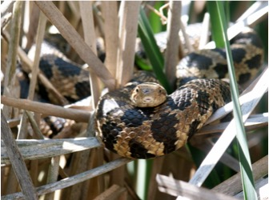

# Data Visualization

## Plotting data

In addition to statistical analysis and programming capabilities, R produces publishable quality graphics. Base R has the capacity to create excellent graphs; however, the syntax can sometimes feel a little clunky. Most recent graphing examples that you find online will make use of the wildly popular and exceptionally user-friendly package `ggplot2`. We will use this package throughout this book. There is a excellent book that describes all the details of this package called the [R Graphics Cookbook](https://r-graphics.org/). This chapter will introduce some basic level plotting and options and show you how to modify these options to customize plots. The next chapter will cover Data Exploration (i.e., summarizing and visualizing your data in order to inform your data analysis approach).

The first step is to install and load and the `ggplot2` package. We will also load a data set containing information on Eastern Fox Snakes (“efs_growth.csv”). This data set investigates eastern fox snake (*Pantherophis gloydi*) growth rates ("grate") in two different regions in Ontario ("region"). Reptiles have indeterminate growth (i.e., grow throughout their entire lives), but their growth rates decline as they get older. The dataset also includes measurements on snout-to-vent length ("svl"; a proxy of age). 

```{r eastern-fox-snake, out.width="70%", fig.show="hold", echo=FALSE, fig.align='center'}

```

```{r eval=FALSE, echo=TRUE}
install.packages("ggplot2")
```

```{r eval=TRUE, echo=TRUE, hold=TRUE}
library("ggplot2")
efs<-read.csv("DATA/efs_growth.csv",sep=",",header=TRUE)
head(efs)
str(efs)
```

Imagine that we wanted to make a plot that displayed growth rate as a function of their snout-to-vent length ("svl"; a proxy of age). To plot with `ggplot`, we use the function `ggplot()`, which creates a coordinate system that we can then add layers to. The first argument for the `ggplot()` function is the data set that we want to use. In our case, the data set we want to use is 'efs', which we loaded into our environment above. We then add one or more layers to our ggplot with a `geom_` function. `Geoms` are geometric objects, like points, lines, or bars that we can add to our ggplot coordinate system. In this example, we will create a scatterplot with `geom_point` comparing "svl" to "grate".

```{r eval=TRUE, echo=TRUE}
ggplot(data=efs,aes(x=SVL, y=grate)) +
  geom_point()
```

As expected, we can see the negative relationship between snout-to-vent length (i.e, age) and growth. This helps us visualize the data, but we can improve the plot by adding better labels and making other manipulations to better visualize our data.

## Manipulating plots
We can specify a number of parameters within the `geom_` function. For example, we can modify the colour, transparency, shape, or size of the points. Don't forget that you can also use `?geom_point` to understand what else you can do with this code or other `geom_` functions.

```{r eval=TRUE, echo=TRUE}
ggplot(data=efs, aes(x= SVL, y=grate)) +   
	geom_point(colour = "blue",  # change the colour of points
			   alpha = 0.50,  # change the transparency
			   shape = 20,  # change the shape of the point
			   size = 2)  # change the size of the point
```

R use numeric codes to represent different plot characters (`pch`), specified by the `shape` option in `ggplot2`. You can find indexes to these characters online or by typing `?pch` into the console. R defaults to the variable name. Frequently, these are difficult to decipher outside of your research group and need to be revised for publication and dissemination. 

```{r eval=TRUE, echo=TRUE}
ggplot(data=efs, aes(x= SVL, y=grate)) +   
	geom_point()+
	labs(x = "Snout-to-Vent Length (mm)",
		 y = "Growth Rate (mm/day)") +
	scale_x_continuous(breaks = seq(0,1500,100))+
	scale_y_continuous(breaks = seq(-1,3,0.5))
```

All aspects of the graph are adjustable. It is often helpful to sketch your ideal plot first by hand and then figure out how plot it using `ggplot2`. You can also use `themes` in `ggplot2` to change the overall appearance of your plot and control all non-data display. There are many built-in themes and you can review their details [online](https://ggplot2.tidyverse.org/reference/ggtheme.html). You can also create your own `theme()` that you can replicate across analyses so that all your plots have a similar format. Themes are covered in Chapter 9 of the [R Graphics Cookbook](https://r-graphics.org/). A simple example of how to add a theme to your plot and a legend is here: 

```{r eval=TRUE, echo=TRUE}
ggplot(data=efs, aes(x= SVL, y=grate, colour=region)) +   
	geom_point() +
	labs(x = "Snout-to-Vent Length (mm)",  # change x label
		 y = "Growth Rate (mm/day)",  # change y label
		 colour = "Region") + # colour code points by Region
	scale_x_continuous(breaks = seq(0,1500,100)) +  # specify x-scale
	scale_y_continuous(breaks = seq(-1,3,0.5)) +  # specify y-scale
	theme_classic()	 # specify theme
```

## Adding low-level plotting functions

Low-level plotting functions plot on already existing plots. For example suppose we had preformed a regression and wanted to add a regression line to our plot to further visualize the negative relationship between age and growth rate of Eastern fox snakes. We can do this using the geom_smooth function to add the regression line to the plot. 

```{r eval=TRUE, echo=TRUE}
ggplot(data=efs, aes(x= SVL, y=grate, colour=region)) +      
		geom_point()+   
		labs(x = "Snout-to-Vent Length (mm)",        
			y = "Growth Rate (mm/day)",
			colour = "Region") +   
		scale_x_continuous(breaks = seq(0,1500,100))+
		scale_y_continuous(breaks = seq(-1,3,0.5)) +   
		theme_classic()+  # add a theme
		geom_smooth(method="lm")  # add a regression line to our plot
```

## Facet plots

When displaying data it is often useful to have multiple items highlighted on a single plot or to have a multi-panel plot for related data. Below we provide an example using this data to make a facet plot with the `facet_grid` function. Again make sure you use help to understand what is happening with each line of code if it is not familiar to you (e.g, `?facet_grid`).

Here, we are going to create a plot that compares growth rate with age for females and males at each different region. We will produce two separate plots for each region that compare males and females. We will also add regression lines.

```{r eval=TRUE, echo=TRUE}
ggplot(data=efs, aes(x= SVL, y=grate, colour=sex)) +      
		geom_point()+   
		labs(x = "Snout-to-Vent Length (mm)",        
			y = "Growth Rate (mm/day)",
			colour = "Region") +   
		scale_x_continuous(breaks = seq(0,1500,100)) +
		scale_y_continuous(breaks = seq(-1,3,0.5)) +   
		theme_classic() +  # add a theme
		geom_smooth(method="lm") +  # add a regression line to our plot
		facet_grid(vars(region))  # add the facet grid for a variable of your choice
```

Developing your plots in R is a great way to improve and maintain your R skills. This may seem like extra work compared to point-and-clicking your way through Excel to create a similar plot; but coding your plots allows for easy replication, update, sharing, and transparency. The code may look fairly complex to create a simple looking plot, but much of the code repeats and can be reused in future efforts. 

The last thing we will do is save our plot to our working directory. You can do this through RStudio with the Export function in the plotting window; however, it is more useful to learn how to save with code so that you can make specifications to your figure size and file type. This can be accomplished using the `ggsave` function to output the figure with a specific size and file type. All journals have specifications regarding the size, file type, and resolution of figures for publication. The `ggsave` function an associated options ensures that you meet those criteria when submitting your research for publication.

```{r eval=FALSE, echo=TRUE}
ggsave ("efs.figure.pdf", device = "pdf", width = 7.5, height = 5, units = "in")
```

